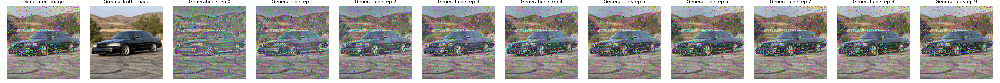
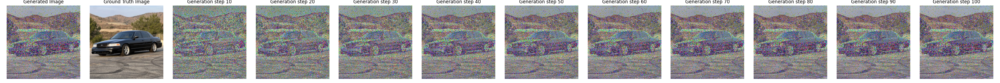
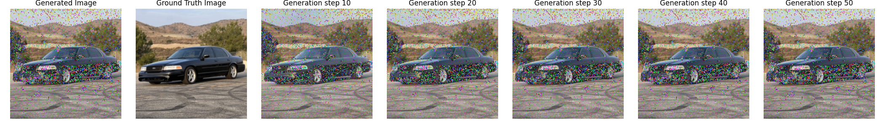

# Reconstructing Images from CNN feature maps

## Overview
This portion of the project implements feature visualization from the paper *A Neural Algorithm of Artistic Style*. Specifically, it reconstructs an image from its feature representations at different layers of a VGG-19 network. The goal is to understand how different layers encode image information, with deeper layers capturing higher-level features.

## Implementation Details
### Model
I use a pre-trained VGG-19 model, excluding its fully connected layers.  The feature representations are extracted from convolutional layers of the network.

### Content Reconstruction
Given an input image, its feature representations are extracted from a chosen convolutional layer. We then perform gradient descent on a randomly initialized image to optimize it until its feature representations match those of the original image.

The content loss function is defined as:

$L_{content}(p, x, l) = \frac{1}{2} \sum_{i,j} (F^l_{ij} - P^l_{ij})^2$

where:
- $( P^l)$ and $(F^l)$ are feature representations of the original and generated images, respectively, at layer $( l )$.
- $( i )$ and $( j )$ iterate over the feature maps of layer $( l )$.

The gradient of the content loss with respect to the activations in layer $( l)$ is given by:


```math
\frac{\partial L_{content}}{\partial F^l_{ij}} = \begin{cases} (F^l - P^l)_{ij} & \text{if } F^l_{ij} > 0 \\ 0 & \text{if } F^l_{ij} < 0 \end{cases}
```


This allows us to iteratively update the image $( x)$ to match the original image $( p )$ at the selected layer.


## Results
Below are the reconstructed images from different layers of VGG-19, showing how each layer captures different levels of abstraction:



  


