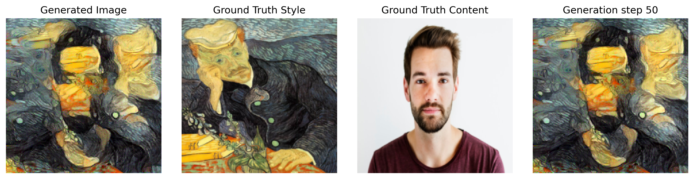
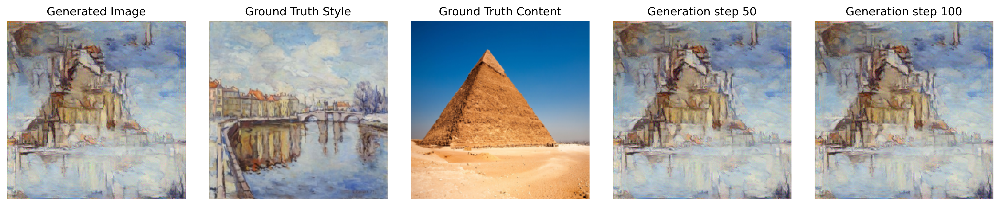

# Style Transfer with PyTorch

This repository contains my implementation of **Neural Style Transfer** using PyTorch.  
**Paper Abstract**: 
> In fine art, especially painting, humans have mastered the skill to create unique visual experiences through composing a complex interplay between the content and style of an image. Thus far the algorithmic basis of this process is unknown and there exists no artificial system with similar capabilities. However, in other key areas of visual perception such as object and face recognition near-human performance was recently demonstrated by a class of biologically inspired vision models called Deep Neural Networks.Here we introduce an artificial system based on a Deep Neural Network that creates artistic images of high perceptual quality. The system uses neural representations to separate and recombine content and style of arbitrary images, providing a neural algorithm for the creation of artistic images. Moreover, in light of the striking similarities between performance-optimised artificial neural networks and biological vision, our work offers a path forward to an algorithmic understanding of how humans create and perceive artistic imagery.
## My Results

| Human Portrait                                                                         | Pyramids                                                                                   |
|----------------------------------------------------------------------------------------|--------------------------------------------------------------------------------------------|
|  |  |
|  | |

## Implementation Details

This implementation uses **PyTorch** to apply style transfer using a pre-trained convolutional neural network (CNN). The approach is inspired by the original **Gatys et al. (2015)** paper, which optimizes an image to minimize content and style loss. Instead of training a separate model, this method directly updates the pixel values of the input image through backpropagation.

### Key Features of This Implementation:
- Uses **VGG19** as the feature extractor, relying on its pre-trained layers for computing content and style loss.
- Optimizes the input image rather than training a separate transformation network.

The code is modular and well-structured, making it easy to experiment with different layers, losses, and hyperparameters.

## Play with It on Kaggle
Try out the implementation in this **Kaggle Notebook**: [Style Transfer on Kaggle](https://www.kaggle.com/code/mistaluai/styletransfer)

## Features

* Based on PyTorch for easy customization  
* Supports any content & style images  
* Includes a Kaggle notebook for quick testing  

---
Feel free to contribute, suggest improvements, or just have fun creating cool artwork!

